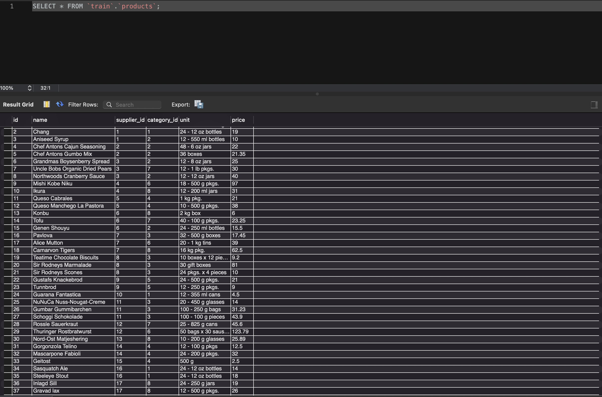
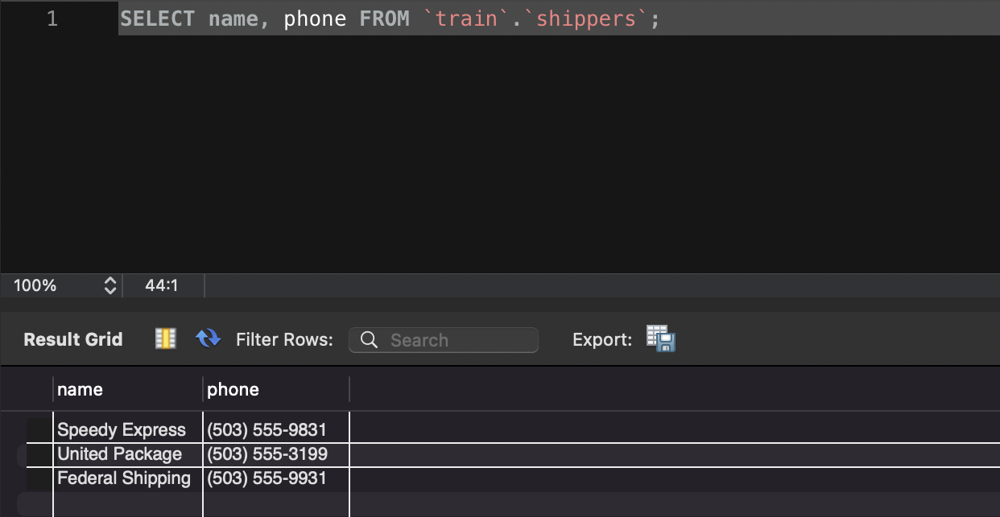
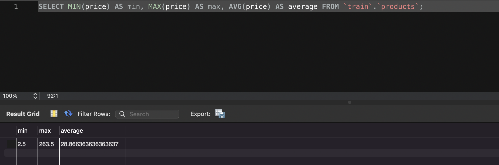
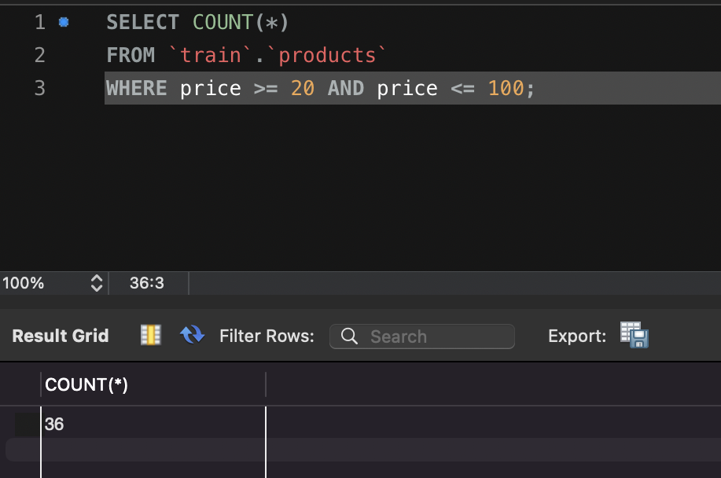
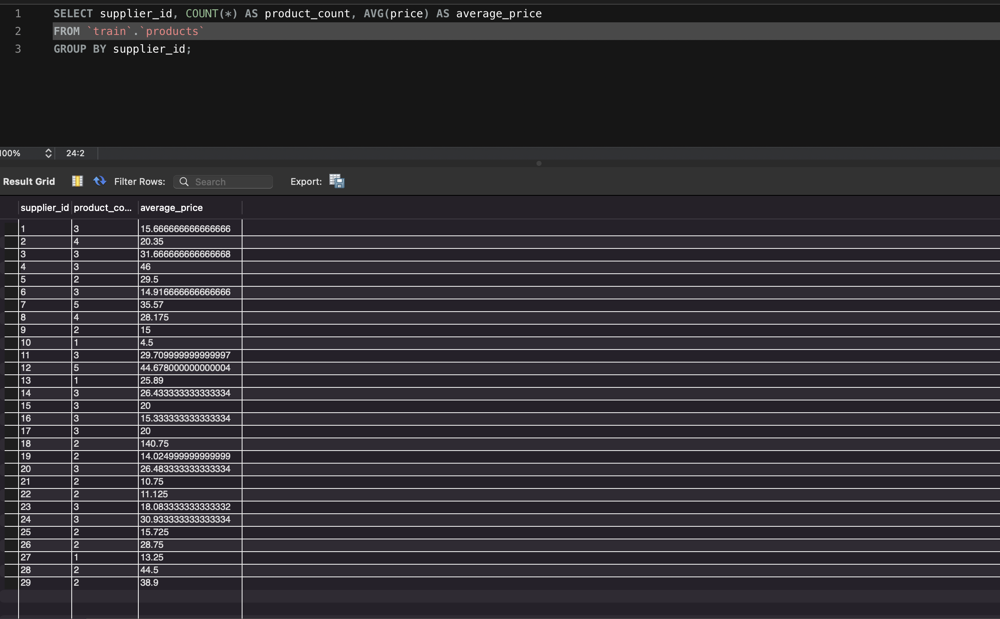

# Домашнє завдання до Теми 3. Завантаження даних та основи SQL. DQL команди

## 1.1. Вибрати всі стовпчики (За допомогою wildcard “\*”) з таблиці “products”;

```js
SELECT \* FROM `train`.`products`;
```



## 1.2. Вибрати тільки стовпчики name, phone з таблиці shippers

```js
SELECT name, phone FROM `train`.`shippers`;
```



## 2. Напишіть SQL команду, за допомогою якої можна знайти середнє, максимальне та мінімальне значення стовпчика price таблички products

```js
SELECT MIN(price) AS min, MAX(price) AS max, AVG(price) AS average FROM `train`.`products`;
```



## 3. Напишіть SQL команду, за допомогою якої можна обрати унікальні значення колонок category_id та price. Оберіть порядок виведення на екран за спаданням значення price та виберіть тільки 10 рядків

```js
SELECT DISTRINCT category_id, price
FROM `train`.`products`
ORDER BY price DESC
LIMIT 10;
```


## 4. Напишіть SQL команду, за допомогою якої можна знайти кількість продуктів (рядків), які знаходиться в цінових межах від 20 до 100

```js
SELECT COUNT(*)
FROM `train`.`products`
WHERE price >= 20 AND price <= 100;
```



## 5. Напишіть SQL команду, за допомогою якої можна знайти кількість продуктів (рядків) та середню ціну (price) у кожного постачальника (supplier_id)

```js
SELECT supplier_id, COUNT(*) AS product_count, AVG(price) AS average_price
FROM `train`.`products`
GROUP BY supplier_id;
```


